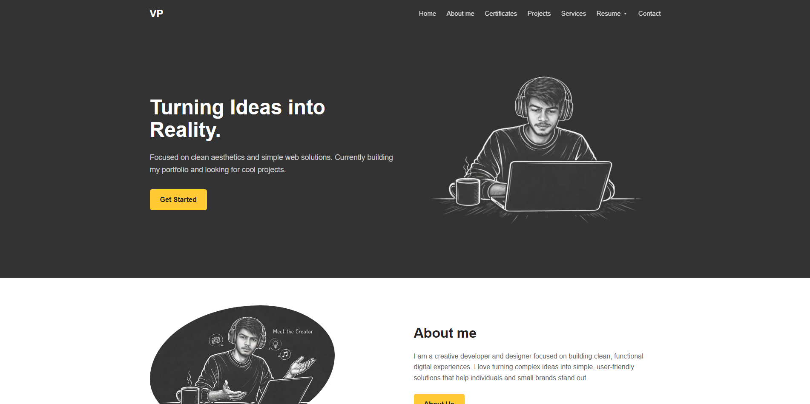
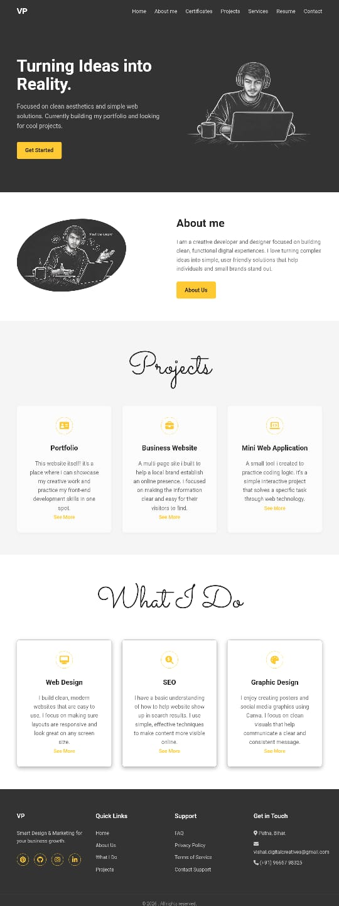

🌐 Personal Portfolio Website

This is my personal portfolio website showcasing my skills, projects, and certifications as a developer and digital marketer.

🔗 Live Website: https://codemask-ov0.github.io/portfolio-website/

---

📌 About the Project

This portfolio is designed to present my work, technical skills, and achievements in a clean and interactive way. It includes sections like:

- Hero / Landing Section
- About Me
- Projects
- Services
- Certifications
- Footer

---

🚀 Features

- Responsive design (mobile-friendly 📱)
- Clean and modern UI
- Downloadable resume
- Project showcase section
- Certification display
- Smooth navigation and layout

---

🛠️ Tech Stack

- HTML5
- CSS3
- JavaScript
- Git & GitHub

---

## 📂 Project Structure
```
portfolio/
│── assets/
│   ├── css/            # Stylesheets
│   ├── js/             # JavaScript files
│   ├── images/         # Images and icons
│
│── index.html          # Main landing page
│── projects.html       # Projects showcase
│── services.html       # Services offered
│── contact.html        # Contact page
│── certificate.html    # Certifications page
│
│── README.md           # Project documentation
```
---

## 📸 Screenshots




---

⚙️ Setup & Usage

1. Clone the repository

git clone https://github.com/your-username/your-repo-name.git

2. Open the project folder
3. Run "index.html" in your browser

---

📬 Contact Me

- LinkedIn: https://www.linkedin.com/in/vishal-prasad-006499214/
- Email: vishal.digitalcreatives@gmail.com

---

💡 Future Improvements

- Improve animations
- Add more projects

---

⭐ Show Your Support

If you like this project, please give it a ⭐ on GitHub!